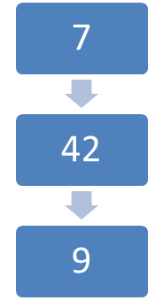
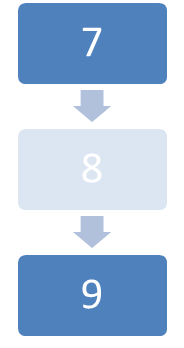

# wpfUndo

WPF UndoManager provides a simple undo manager that can easy integrate in your **Viewmodel** and support you using the **MVVM-Pattern**.

There exists two methods how to use the undo manager.

*   #### Using an implementation of the ICommand-Interface

    The undo manager provides an implementation of ICommand, specifying a Method that can reverse the Command.
*   #### Using the INotifyPropertyChanged-Interface

    Using this interface and reflection the undo manager monitors all changes to property's of INotifyPropertyChanged and INotifyCollectionChanged.

Just two lines of code can provide you a basic undomanager.


* * *


# Using the UndoManager

There are different ways to use this Library. Depending on how complex your application is you can pick any way, or combine them.

Before we can start, its necessary to control the UndoManager from the view.

## Undo and Redo form the view

UndoManager expose two ICommand-Property’s. Bind the Command value of a Button to it and you are ready.


```xaml
<Window x:Class="WpfApplication1.MainWindow" 
        xmlns="http://schemas.microsoft.com/winfx/2006/xaml/presentation" 
        xmlns:x="http://schemas.microsoft.com/winfx/2006/xaml" 
        xmlns:local="clr-namespace:WpfApplication1" 
        Title="MainWindow" Height="350" Width="525"> 
    <Window.Resources> 
        <local:ViewModel x:Key="ViewModelDataSource" /> 
    </Window.Resources> 
    <StackPanel DataContext="{Binding Source={StaticResource ViewModelDataSource}}"> 
        <Button Content="Undo" Height="23" Width="75" Command="{Binding Path=UndoManager.Undo}" /> 
        <Button Content="Redo" Height="23" Width="75" Command="{Binding Path=UndoManager.Redo}" /> 
    </StackPanel> 
</Window> 
```

## Monitor property's via reflection

Create your viewmodel and add a property for the UndoManager. In the constructor you create a new UndoManager using your viewmodel as parameter and assign this to the property.
```c#

public class ViewModel : INotifyPropertyChanged 
    { 
        //... 
  
        public UndoManager UndoManager { get; private set; } 
         
        //... 
         
        public ViewModel() 
        { 
            //... 
            UndoManager = new UndoManager(this); 
            //... 
        } 
  
        //... 
         
    } 

```

That’s it the UndoManager registers any change to the property's and allow you to revert these changes. You can pass as many INotifyPropertyChanged instances in the constructor as you wish.

### Ignoring Property’s

Maybe you’ve got property’s you don’t want to monitor. In this case you can add an Attribute to this property so it wont be monitored.

```c#
[IgnorUndoManager]
```

### Automatic Unite Changes

Ok sometimes you have Property’s the user change successive and all these changes should be regarded as one step.

Below is a sample. We have an int value and want to track the changes. In the case that our user increase the value every time by one, we suggest that this different changes should be one.

 

This sample demonstrate, if the value change from 7 to 42 and then to 9, all these changes should get recorded. If we change from 7 over 8 to 9 this is one step, the 8 should not be recorded.

In order to achieve this we add an attribute to this property.

```c#
[IntFuse]
```

This attribute extends the abstract Attribute FusePropertyChangeAttribute implementing the method FuseFunction.

These method has three arguments and returns true if those changes can be united.

```c#
class IntFuseAttribute : FusePropertyChangeAttribute 
{ 
    protected override bool FuseFunction(object originalValue, object firstChange, object seccondChange) 
    { 
        int s1 = (int)originalValue; 
        int s2 = (int)firstChange; 
        int s3 = (int)seccondChange; 
        if (s1 == s2 + 1 && s2 == s3 + 1) 
            return true; 
        if (s3 == s2 + 1 && s2 == s1 + 1) 
            return true; 
        return false; 
    } 
} 
```

In the sample above originalValue would be 7, firstChange 8 and seccondChange 9\. The return value would be true and the 8 will not be recorded by the undomanager. Hitting undo resets the value to 7.


* * *
### TODO:

*   ~~Write the Documentation Write Documentation for new Functions~~
*   ~~Monitor Collections.(Current only in source code not in build)~~
*   Batch multiple Changes.

